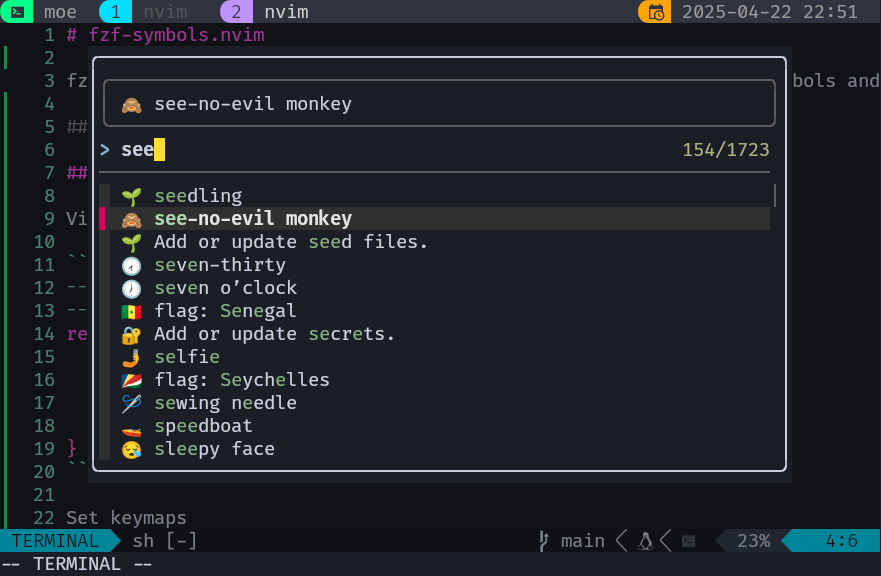

# fzf-symbols.nvim

fzf-symbols.nvim provide its users with the ability of picking symbols and insert them at point.



## Installation

Via Lazy

```lua
-- Emoji and Gitmoji via fzf-lua
--https://github.com/mistweaverco/fzf-symbols.nvim
return {
  'mistweaverco/fzf-symbols.nvim',
  dependencies = {
    'ibhagwan/fzf-lua',
  },
}
```

Set keymaps

```lua
vim.keymap.set("i", "<C-e>", function()
  require("fzf-symbols").open()
end)
```
